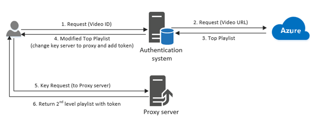

# HLSSafariProxy-ASP.NET

## Introduction
This repository contains an example code for ASP.NET Core API which will handle the proxy solution in order to allow to play the videos stored in Azure Media Services on iOS devices, as well as older Android devices.

It will follow the blog post originally made by **Mingfey Yan**. The link to the blogpost: https://azure.microsoft.com/en-us/blog/how-to-make-token-authorized-aes-encrypted-hls-stream-working-in-safari/

You can find that blog post below:

> ## How to make token authorized AES encrypted HLS stream working in Safari
> Azure Media Services provides capability for customers to generate an AES encrypted HLS stream with Token authorization configured on the AES key retrieval. However, as we know, Safari handles HLS playlist and key retrieval within the native stack and there is no easy way for developers to intercept the key request and add in Token into the 2nd level HLS Playlist. Here is a proposed solution if you do some magic on your authentication module to make this work. Below is an diagram to illustrate how this solution works:
> 
> 
> 
>
> ## Explanation for each step:
> 1. Customer sends request to your authentication system with video ID. it is important that you have some mapping between video ID and the actual streaming URL.
> 2. Your authentication system will authenticate user, and request top Playlist from Azure Media Services with video streaming URL. Let’s say the streaming URL looks like this: *(format=m3u8-aapl)*.
> 3. Azure Media Services will return the top Playlist to the Authentication system. The top playlist looks like this:
> ```
> #EXTM3U
> #EXT-X-VERSION:4
> #EXT-X-MEDIA:TYPE=AUDIO,GROUP-ID="audio",NAME="AAC_und_ch2_96kbps",URI="QualityLevels(92405)/Manifest(AAC_und_ch2_96kbps,format=m3u8-aapl)"
> #EXT-X-MEDIA:TYPE=AUDIO,GROUP-ID="audio",NAME="AAC_und_ch2_56kbps",DEFAULT=YES,URI="QualityLevels(53017)/Manifest(AAC_und_ch2_56kbps,format=m3u8-aapl)"
> #EXT-X-STREAM-INF:BANDWIDTH=1092766,RESOLUTION=384x288,CODECS="avc1.4d4015,mp4a.40.2",AUDIO="audio"
> QualityLevels(960870)/Manifest(video,format=m3u8-aapl)
> #EXT-X-STREAM-INF:BANDWIDTH=1607960,RESOLUTION=480x360,CODECS="avc1.4d401e,mp4a.40.2",AUDIO="audio"
> QualityLevels(1464974)/Manifest(video,format=m3u8-aapl)
> #EXT-X-STREAM-INF:BANDWIDTH=62343,CODECS="mp4a.40.2",AUDIO="audio"
> QualityLevels(53017)/Manifest(AAC_und_ch2_56kbps,format=m3u8-aapl)
> ```
> 4. Modify the top playlist, so the player (Safari in this case) will ping proxy server instead of our key services directly, and add token into the playlist. The authentication system has the knowledge of the how to compose the token but proxy server doesn’t. Here is the way how top playlist is modified:
> ```
> #EXTM3U
> #EXT-X-VERSION:4
> #EXT-X-MEDIA:TYPE=AUDIO,GROUP-ID="audio",NAME="AAC_und_ch2_56kbps",URI="https://test.cloudvideo.azure-int.net/api/ManifestProxy?playbackUrl=(53017)/Manifest(AAC_und_ch2_56kbps,format=m3u8-aapl)&token=[PUT_YOUR_TOKEN_HERE]"
> #EXT-X-MEDIA:TYPE=AUDIO,GROUP-ID="audio",NAME="AAC_und_ch2_96kbps",DEFAULT=YES,URI="https://proxy.cloudvideo.azure-int.net/api/ManifestProxy?playbackUrl=(92405)/Manifest(AAC_und_ch2_96kbps,format=m3u8-aapl)&token=[PUT_YOUR_TOKEN_HERE]"
> #EXT-X-STREAM-INF:BANDWIDTH=1092766,RESOLUTION=384x288,CODECS="avc1.4d4015,mp4a.40.2",AUDIO="audio"
> https://proxy.cloudvideo.azure-int.net/api/ManifestProxy?playbackUrl=(960870)/Manifest(video,format=m3u8-aapl)&token=[PUT_YOUR_TOKEN_HERE]
> #EXT-X-STREAM-INF:BANDWIDTH=1607960,RESOLUTION=480x360,CODECS="avc1.4d401e,mp4a.40.2",AUDIO="audio"
> https://proxy.cloudvideo.azure-int.net/api/ManifestProxy?playbackUrl=(1464974)/Manifest(video,format=m3u8-aapl)&token=[PUT_YOUR_TOKEN_HERE]
> ```
> In the example above, you need to put in an absolute path in URI (otherwise, the request will come back Auth server):
> * [https://test.cloudvideo.azure-int.net/api/ManifestProxy?](https://test.cloudvideo.azure-int.net/api/ManifestProxy?) is the address for your proxy server and ManifestProxy is just a parameter for your to parse the URI later
> * PlaybackURL is the actual streaming URL (however, the URL now is the 2nd level manifest with quality level appends
> * Token is appended at the end as a parameter. Our key services accept token as parameter in the key request
> 5. Safari now will send  request based on the URL provided in URI parameter to retrieve 2nd level playlist which contains the key information. Since we changed the playlist to point to our proxy server, the request will come to proxy server 6. Our proxy server will receive the 2nd level playlist request. Remove [https://test.cloudvideo.azure-int.net/api/ManifestProxy?](https://test.cloudvideo.azure-int.net/api/ManifestProxy?) and ping origin server with the playbackUrl in the playlist to get 2nd playlist with actual key URL in it. And append the token within this 2nd level Playlist. So the returned playlist looks like this:
> ```
> #EXTM3U
> #EXT-X-VERSION:4
> #EXT-X-ALLOW-CACHE:NO
> #EXT-X-MEDIA-SEQUENCE:0
> #EXT-X-TARGETDURATION:10
> #EXT-X-KEY:METHOD=AES-128,URI="https://test.keydelivery.mediaservices.windows.net/?kid=a99263cd-43b3-490a-a4d6-ea04d4645fb7&token=[PUT_YOUR_Token]
> #EXT-X-PROGRAM-DATE-TIME:1970-01-01T00:00:00Z
> #EXTINF:3.947392,no-desc
> (92405)/Fragments(AAC_und_ch2_96kbps=0,format=m3u8-aapl)
> #EXT-X-ENDLIST
> ```
> 7. Safari now will send a key request with the URI after **#EXT-X-KEY:METHOD=AES-128,URI=** to our key server. Since a token is embedded as a parameter, our key service could authorize the request and give player the AES key. We've made this work by uploading code we used to modify the playlist on proxy server [here](https://github.com/AzureMediaServicesSamples/HLSSafariProxy), and you can see a working sample site [here](https://mingfeiy.azurewebsites.net/). Please feel free to reach out if you have any questions!

As the code example attached in **Mingfey Yan** post is using WebAPI as its host, and the ASP.NET Core API needs few adjustments, after working together with Microsoft Support I've decided to show the example of the working code for public.

It is important to mention that [example code](https://pastebin.com/kq7Zfw88) from [StackOverflow post](https://stackoverflow.com/questions/40506415/azure-media-player-does-not-work-with-aes-protection-on-iphone) user [Eugene D. Gubenkov](https://stackoverflow.com/users/1319147/eugene-d-gubenkov) was also a big help during the creation of this solution

## Credits
* **Mingfey Yan** for original blog post
* **Eugene D. Gubenkov** for his piece of code which is used within this example
* **Ebraheem Al-Muneyeer** from *Azure Media & Communication Services* for providing support on my case and directing me in the right direction

## Important mentions
In the example, we've made few adjustments in order to make it to work:
* In order for this solution to work with the video player, you need to exchange the **source URL** from the manifest to the top level proxy endpoint, for example if we take:
  * **http://amssamples.streaming.mediaservices.windows.net/830584f8-f0c8-4e41-968b-6538b9380aa5/TearsOfSteelTeaser.ism/manifest** as original manifest URL
  * and
  * **https://localhost:5001/AzureMediaServicesProxy/GetTopLevelPlaylist?playbackUrl="http%3A%2F%2Famssamples.streaming.mediaservices.windows.net%2F830584f8-f0c8-4e41-968b-6538b9380aa5%2FTearsOfSteelTeaser.ism%2Fmanifest&token=Bearer%3Dyour_token_here** as top level manifest proxy url
  * the end result of video element should look similar to one below:
  ```html
    <html>
    <head>
        <link href="//amp.azure.net/libs/amp/latest/skins/amp-default/azuremediaplayer.min.css" rel="stylesheet">
        <script src="//amp.azure.net/libs/amp/latest/azuremediaplayer.min.js"></script>
    </head>
    <body>
      <video
              id="id_of_the_player"
              class="azuremediaplayer amp-default-skin w-full h-full"
              controls
              controlsList="nodownload"
              oncontextmenu="return false;"
              poster="https://thumbnail_uri.com/thumbnail.webp">
              <source src="https://localhost:5001/AzureMediaServicesProxy/GetTopLevelPlaylist?playbackUrl="http%3A%2F%2Famssamples.streaming.mediaservices.windows.net%2F830584f8-f0c8-4e41-968b-6538b9380aa5%2FTearsOfSteelTeaser.ism%2Fmanifest&token=Bearer%3Dyour_token_here" type="application/vnd.apple.mpegURL" data-setup="{"disableUrlRewriter": true}"/>
              <source src="http://amssamples.streaming.mediaservices.windows.net/830584f8-f0c8-4e41-968b-6538b9380aa5/TearsOfSteelTeaser.ism/manifest" type="application/vnd.ms-sstr+xml" data-setup="{"protectionInfo": [{"type": "AES", authenticationToken": Bearer=" + your_token_here + ""}]}"/>
      </video>
    </body>
    </html>
    ```
  * and JavaScript code to load the player should similar to the one below:
  ```javascript
      var player = amp("id_of_the_player", {
                techOrder: ["azureHtml5JS", "flashSS", "html5FairPlayHLS","silverlightSS", "html5"],
                "nativeControlsForTouch": false,
                autoplay: false,
                controls: true,
                logo: {
                    enabled: false
                },
                fluid: true,
                disablePictureInPicture: false
            });
        }
  ```
  * **Please be aware of the message that LATEST version of Azure Media Player should NOT be used in production environments, find official message from Microsoft documentation below:**
    * _You should **NOT** use the `latest` version in production, as this is subject to change on demand. Replace `latest` with a version of Azure Media Player; for example replace `latest` with `1.0.0`. Azure Media Player versions can be queried from [here](https://amp.azure.net/libs/amp/latest/docs/changelog.html)._
* When fetching the top and second manifest for this method, URL for the manifest must contain **format=m3u8-aapl** in it - for example 
  * https://teststreamurl.media.azure.net/71dd573d-dae9-4e02-a304-6d65a50f7f3f/videoname.ism/manifest(encryption=cbc,format=m3u8-aapl)
  * or
  * https://teststreamurl.media.azure.net/71dd573d-dae9-4e02-a304-6d65a50f7f3f/videoname.ism/manifest(format=m3u8-aapl)
* When adding a token for both top and second playlists in the URL (*&token=[PUT_YOUR_TOKEN_HERE]* part) it is important to mention that the token should be in format *Bearer=your_token*
* Both URL and token should be URL encoded - so instead:
    * *https://test.keydelivery.mediaservices.windows.net/?kid=a99263cd-43b3-490a-a4d6-ea04d4645fb7* it should be *https%3A%2F%2Ftest.keydelivery.mediaservices.windows.net%2F%3Fkid%3Da99263cd-43b3-490a-a4d6-ea04d4645fb7*
    * *Bearer=your_token* it should be *Bearer%3Dtoken*
    * It is important that tokens between top and second manifests are the same
* It is very important that the response returned from endpoints to the video player when it is trying to fetch manifests has **Content-Type** of **application/vnd.apple.mpegurl**
* Responses should be encoded in **UTF8**

If you have proposals how the solution can be improved, you are welcome to contact me or write a post within this repository.

## Running the solution
In order to run the solution, you need to have .NET 5 framework installed. 

After running the solution, you can go to https://localhost:5001/swagger in order to see the endpoints and test them.

You can also access the solution going [here](https://hlssafariproxy-aspnet.azurewebsites.net/swagger/)

## Example of the solution

Working example of the working solution is implemented within **Swap Language** website (https://swaplanguage.com).

Go to below example link to check the working solution:
[Best Danish Films To Watch](https://swaplanguage.com/online-lessons/single/bd45aaa6-a688-4516-2cce-08d9326171fa)